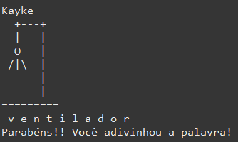

# Jogo da Forca
---
Este jogo da forca é um projeto de três estudantes do terceiro período do curso de Ciência da Computação. A matéria em questão é Linguagem de Programação II. Assim, nos foi proposto idealizar um programa em Java no qual contivesse uma lista com os seguintes itens:
- Introdução a Linguagem Java;
- Tipos de dados, constantes e variáveis/Entrada e Saída de Dados;
- Comandos de Seleção;
- Comandos de Iteração;
- Vetores e Matrizes;
- Manipulação de Strings;
- Funções, Procedimentos e Recursividade;
- Registros e Enumerações.
- Introdução a Programação Orientada a Objetos;
- Classes, atributos e métodos;
- Objetos e Construtores;
- Atributos e métodos estáticos.
---

#### Funcionalidades Planejadas
- [x] Jogo da forca funcional
- [ ] Um placar de pontuação.
- [ ] Armazenamento dessa pontuação
- [ ] Tela de exibição do jogo.
---
#### Problemas Conhecidos
- Caracteres especiais e números podem atrapalhar a experiência com o programa.
- O programa está CaseSensetive, ou seja, há diferenciação entre letras maiúsculas e minúsculas. Esse ponto pode atrapalhar a experiência do usuário.
- Letras erradas que foram digitadas podem ser digitadas novamente, podendo prejudicar a experiência.
- O jogo não funciona corretamente com mais de um jogador.
