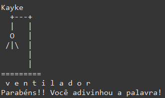
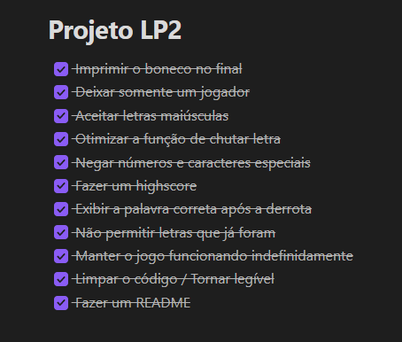

# Jogo da Forca
---
Este jogo da forca é um projeto de três estudantes do terceiro período do curso de Ciência da Computação. A matéria em questão é Linguagem de Programação II. Assim, nos foi proposto idealizar um programa em Java no qual contivesse uma lista com os seguintes itens:
- Tipos de dados, constantes e variáveis/Entrada e Saída de Dados;
- Comandos de Seleção;
- Comandos de Iteração;
- Vetores e Matrizes;
- Manipulação de Strings;
- Funções, Procedimentos e Recursividade;
- Registros e Enumerações.
- Introdução a Programação Orientada a Objetos;
- Classes, atributos e métodos;
- Objetos e Construtores;
- Atributos e métodos estáticos.

---
## Metodologia
- O jogo da forca foi pensado como forma de utilizar, principalmente, a manipulação de Strings de forma ampla e bastante útil, sendo a melhor forma encontrada de demonstrar nossos conhecimentos acerca desse e de outros assuntos.
- Tendo em mente a concepção inicial da ideia, foi feito um desenvolvimento melhor do planejamento, onde encontramos a quantidade de jogadores e forma como o projeto poderia funcionar. Foi feita, também, uma rápida base da programação do jogo para que tivéssemos noção do que poderia ser feito.
- Analisando todos os pontos supracitados, fez-se necessário uma lista de tarefas para que fossem divididas as atvidades entre os integrantes do grupo. Assim, montamos um grupo de Whatsapp para discutir quem faria cada funcionalidade e começamos a desenvolver, mandando todos os códigos - feitos no Eclipse - para o GitHub, através do GitHub Desktop. Essa mesma metodologia foi utilizada para todos os integrantes.

---
#### Funcionalidades Planejadas
- [x] Jogo da forca funcional.
- [x] Um placar de pontuação.
---
#### Problemas Conhecidos
- Todos os problemas conhecidos no momento foram corrigidos.
